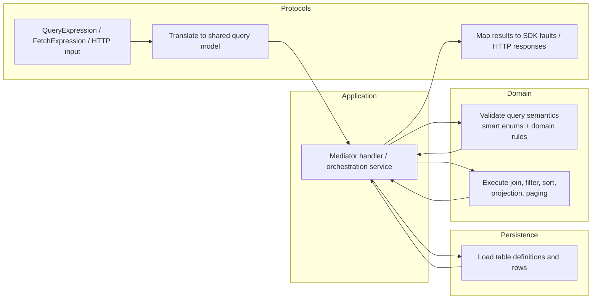

# Architecture

## Intent

The emulator should behave like a local Dataverse environment that real applications can connect to, not just a fake repository behind a test seam.

The current architecture separates three concerns that will keep evolving at different speeds:

1. Shared Dataverse-like semantics.
2. Client and protocol compatibility.
3. Storage and local developer workflow tooling.

The current product posture is:

- local-development first
- Aspire-hosted by default
- Xrm/C# compatibility first
- Web API compatibility second

In practice, that means the architecture is being optimized for a local C# developer workflow before it is optimized for broad Dataverse ecosystem parity.

## Dependency Direction

The solution is organized so protocol and persistence details depend on the shared core, not the other way around.

```text
AppHost
`- Host
   |- Protocols
   |- Persistence.InMemory
   `- Application
      `- Domain
```

## Boundary Rules

- `Domain` owns transport-agnostic emulator semantics.
- `Application` owns orchestration, repository access, and use-case flow.
- `Protocols` translate external contracts into the shared application/domain flow and map results back out.
- `Persistence` provides storage and query access, but does not own protocol parsing or emulator-specific transport behavior.

If a behavior can be explained without mentioning HTTP, SOAP, SDK DTOs, or a concrete repository implementation, it should usually live in the domain.

## ADR Pattern Enforcement

The current boundary is not only about projects. It is also enforced through the core ADR patterns:

- Smart enums belong in the domain when they describe emulator language such as condition operators, filter operators, sort direction, or required levels.
- `ErrorOr` carries expected failures through domain, application, and protocol translation so adapters can map the same outcome into SDK faults or HTTP errors without inventing separate control-flow paths.
- FluentValidation belongs at the application boundary on Mediator requests. It validates request shape and orchestration preconditions, while domain invariants still live in domain factories, aggregate methods, and domain services.
- Validators are optional per request under ADR-012, but when a request needs boundary validation it should be expressed through the centralized pipeline rather than ad hoc protocol checks.

These rules matter because they keep the emulator's meaning stable even as compatibility surfaces expand.

## Project Responsibilities

### `Dataverse.Emulator.Domain`

Owns the transport-agnostic language of the emulator:

- tables and columns
- row identity and invariants
- query concepts that should exist regardless of transport
- validation-oriented domain services
- transport-agnostic linked-query semantics such as join, scoped filter, sort, projection, and paging rules

This project stays free from HTTP, SOAP, SDK, and storage concerns.

### `Dataverse.Emulator.Application`

Owns orchestration and use cases:

- Mediator commands, queries, handlers, and pipeline behaviors
- CRUD workflows
- metadata loading and seeded startup behavior
- abstractions for persistence and query execution
- cross-aggregate orchestration that composes repository access with domain services

If the domain says what is valid, the application layer decides how requests move through the emulator.

### `Dataverse.Emulator.Protocols`

Owns compatibility surfaces:

- hosted Xrm/SOAP compatibility for `CrmServiceClient`
- secondary Dataverse Web API compatibility
- request translation into application commands and queries
- shared transport-level error mapping

This layer should translate external contracts into the shared application flow instead of re-implementing emulator behavior.

Within the Xrm path, prefer small request-oriented slices over a growing monolithic service class. New Xrm behavior should usually arrive as a narrow request handler plus shared translation and mapping helpers, so compatibility can grow one message at a time without blurring the application boundary.

Current scope guidance for this layer:

- Xrm/C# is the primary compatibility contract.
- Web API exists to support the same local emulator story.
- Broader connector-oriented behavior should not drive the design unless a concrete local workflow requires it.

### `Dataverse.Emulator.Persistence.InMemory`

Owns the first storage provider:

- in-memory metadata storage
- in-memory record storage
- query execution over the in-memory dataset
- seeded state for local workflows

Later durable providers should be able to follow the same boundary without disturbing the higher layers.

## Linked Query Flow

The current multi-table Xrm slice is a good example of the intended boundary:



The key point is that the protocol layer may describe the query in emulator terms, but it should not own the actual emulator semantics for evaluating that query.

## Boundary Drift Signals

The architecture should be treated as drifting when any of these start to appear:

- protocol adapters comparing values, joining rows, or sorting result sets directly
- application services growing large because they encode transport-agnostic evaluation rules instead of coordinating repositories and domain services
- transport-specific enums or DTO concepts leaking into domain query models
- expected user-driven failures being thrown as exceptions instead of returned as `ErrorOr`
- invariants being enforced only in validators, with no supporting domain rule or domain service where the concept actually belongs

### `Dataverse.Emulator.Host`

Owns the emulator process itself:

- composition root
- health and diagnostic endpoints
- local emulator administration endpoints
- protocol registration
- seeded startup

### `Dataverse.Emulator.AppHost`

Owns local orchestration:

- default developer entry point
- Aspire health wiring
- reusable emulator resource packaging
- generated connection-string resource shaping for consuming Aspire apps
- future companion resources or supporting services

## Current Implemented Slice

The current proven slice is intentionally narrow:

- two seeded tables: `account` and `contact`
- two entity sets: `accounts` and `contacts`
- one seeded lookup path: `contact.parentcustomerid -> account.accountid`
- in-memory state only
- hosted organization service bootstrap at `/org/XRMServices/2011/Organization.svc`
- transport-agnostic linked-query semantics now live in the shared core rather than the Xrm protocol layer
- C# operations:
  - `Create`
  - `Retrieve`
  - `Update`
  - `Delete`
  - `RetrieveMultiple(QueryExpression)`
  - `RetrieveMultiple(FetchExpression)`
  - `RetrieveMultiple(QueryExpression)` paging via `PageInfo`
  - grouped `AND` / `OR` filters
  - common comparison, null, pattern, and `In` operators
  - top-level inner joins through `LinkEntity`
  - aliased linked-column projection
  - bounded FetchXML support for attributes, filters, ordering, and paging
- Xrm metadata reads:
  - `RetrieveEntity`
  - `RetrieveAttribute`
  - `RetrieveAllEntities`
- generic `Execute` message coverage:
  - `ExecuteMultipleRequest` for batching currently supported slices
- secondary Web API CRUD on `/api/data/v9.2/accounts` and `/api/data/v9.2/contacts`
- local reset endpoint on `/_emulator/v1/reset` for restoring the default seeded state
- public AppHost helper packaging that emits a reusable emulator project resource plus a generated `dataverse` connection string resource
- shared error model mapped to either SDK faults or HTTP errors

That slice is locked down with:

- domain tests
- integration tests for translation and shared-core behavior
- Aspire-hosted end-to-end tests
- a reusable `net48` harness that uses the real `CrmServiceClient`

One current cleanup direction still worth tracking: the single-table in-memory query evaluator and the linked-query domain execution service still duplicate some comparison and filter logic. That is now a cohesion concern rather than a layering problem, and future work should converge those rules where practical.

## Scope Guidance

Keep expanding by real client paths instead of broad platform imitation.

For now, "real client path" should usually mean a real .NET or Xrm-based local application path, not broad Power Platform ecosystem parity.

The preferred sequence is:

1. choose one concrete client or local workflow path
2. implement only the metadata, query, and message behavior that path needs
3. prove it with hosted compatibility tests
4. broaden outward from a verified slice

That is how the current `account` + `CrmServiceClient` slice should continue to grow into a broader local Dataverse emulator without turning into a shallow protocol collection.

The architecture should continue to resist these scope traps unless they are explicitly justified by a target local workflow:

- designing primarily for Power BI
- designing primarily for Power Automate
- treating the Web API surface as the main product instead of a supporting surface
